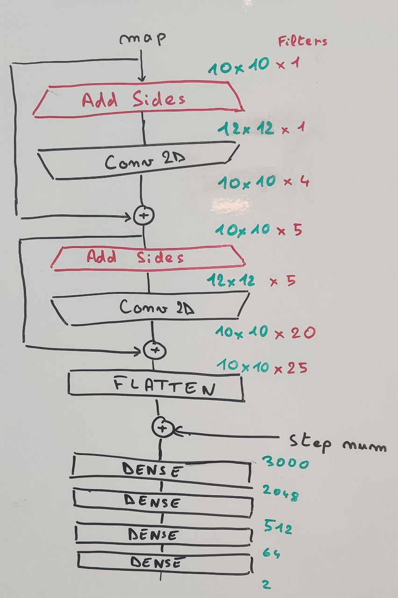

# Harvest - Optimization Competition - Agents
This repository gives a solution to the [Harvest Competition](https://github.com/Kreyparion/Harvest-Competition).

## Installation

For Installation and rules of the environment, you should read the [Readme](https://github.com/Kreyparion/Harvest-Competition#readme) of the competition

## Agents

Here we implemented some possible agents that were performing well on the environment.

### Branch&Bound

This algorithm is similar to a brute-force algorithm but we use an heuristic to make sure that we don't look into the bad solutions. We define the "bad" solution, those that are behind the best solution at any step.
We have 4 different agents, with only different heuristics. The `QuickBranchAndBound` converges quickly to around 41000 and we can use the `CVBranchAndBound` on the `best_at_depth.json` file generated by the `QuickBranchAndBound` to improve the score up to 44000.
To reuse the `best_at_depth.json` file, only switch the `use_json` argument from False to True

### DQN

The DQN is originally from the [Pytorch DQN Tutorial](https://pytorch.org/tutorials/intermediate/reinforcement_q_learning.html) on Cartpole. We adapt the existing structure of the code to the environment and improve some parts

#### The Network

The network has 2 convolutional layers and 4 fully connected layers. The convolutional layers are preceded by a layer that adds the last collomn in the front and the first one in the back and does the same for the rows. This allows to make conviolution and taking into account the looped environment.
These layers are the `Add sides` layers in the picture below

#### The Parameters

- We use a scheduler to decrease slowly the **learning rate**, it allows the agent to converge to a better solution
- We use **epsilon greedy** exploration with a decay and stop at a value were the agent can make 1 or 2 random actions per episode
- **Gamma** is set to 1 so that the agent make long term strategies 
- The **Reward** is centered to allow the qvalues to converge more easily. 

### MCTS

The Monte-Carlo Tree Search algorithm is the classic one with the usuall exploration function. Here it is used to improve the score of the DQN agent.
The point here is doing the rollout (when we calculate the value of a node), that is usually a random exploration to the leaves, with the agent and thus using really good actions. This gives a better approximation of the value of a node and, paired with the exploration of the MCTS, is able to improve the score by a lot.

The point here is that the inference of the DQN Agent is much faster and the exploration of the MCTS is better so we easily find better solutions.
This is the way I was able to achieve a total of 47223 on the Env (with the 42 seed)
You can play for yourself the 47223 execution by running the `evaluate.py` code.

### Other implemented Agents

I implemented other agents on this environment just to learn them and see how they are performing on this type of environment.
For now only reinforce was implemented and performed quite bad on this environment, maxing out at 38000.